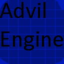

# Advil Engine
Advil Engine is a Java-based 2D game engine built to simplify development with a clean, code centric approach. 

# Features
* Audio
* Debugging features (basic)
* File Management features (ex: file creation, file loading, etc)
* Helper Utilities (includes math)
* Input
* Lighting (not very optimized)
* Physics (simple physics with collisions)
* Window Management (not done as of current since resizing doesnt work properly, and window title doesn’t appear)

# Current Status
Advil Engine is in an early stage of development. While core functionality is being built, you may encounter bugs and incomplete features. Some features commonly found in other 2D engines may not yet be implemented.

# What can I do with the engine?
* Small hobby projects
* Prototypes
* Commercial projects (if build stable)

You are also free to fork and modify the engine to suit your needs.

# Documentation?
Check Documentation.txt
Check out the code examples in Examples.txt which contain many examples

# How to import the engine to my project?
* Download the latest release
* Import LWJGL, Slick2D, and AdvilEngine librarys to your Java IDE of choice and add to build path
* Ensure you are using Java 8
* Load the LWJGL 2.9.3 native files

# Is this engine cross-platform
* ✅ Windows
* ✅ macOS
* ✅ Linux
* ❌ Mobile (Both iOS and Android not supported due to Slick2D and LWJGL limitations)
